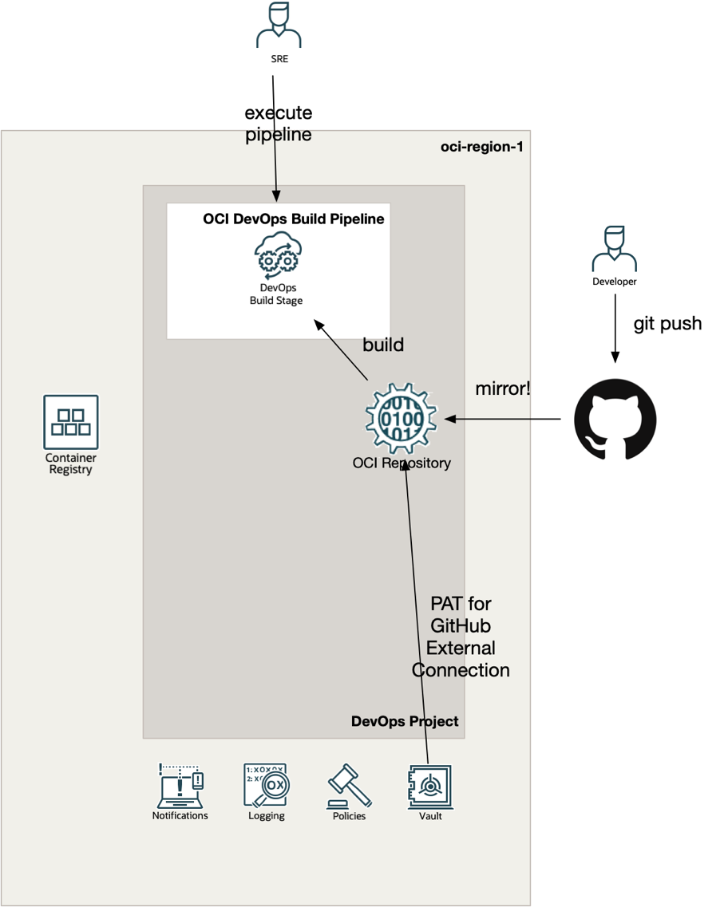

# FoggyKitchen OCI DevOps Service with Terraform 

## LESSON 3 - Adding OCI DevOps Build Pipeline - Build Stage

In the third lesson of the OCI DevOps Service course deployed with Terraform, you will enhance your DevOps project by adding the OCI DevOps Build Pipeline. This lesson specifically focuses on setting up the first stage of the pipeline - the Build Stage.

By utilizing the provided Terraform code, you will configure the Build Stage to execute the build process defined in the build_spec.yaml file located in your OCI DevOps repository. This specification file contains the necessary instructions, including the Docker command, for building an image based on the Dockerfile.

To execute the Build Stage, you will define the compute power required internally by OCI during the build process. This includes specifying the shape of the compute instance, determining the CPU and memory resources allocated. 

By defining the compute shape and networking details, you ensure that the build process has the necessary resources and connectivity to successfully build the image specified in the build_spec.yaml file.

The addition of the OCI DevOps Build Pipeline and the Build Stage enhances your DevOps project by automating the build process and streamlining the creation of containerized images. This paves the way for efficient and consistent application deployments.



## Deploy Using Oracle Resource Manager

1. Click [](https://cloud.oracle.com/resourcemanager/stacks/create?region=home&zipUrl=https://github.com/mlinxfeld/terraform-oci-devops/releases/latest/download/terraform-oci-devops-lesson3.zip)

    If you aren't already signed in, when prompted, enter the tenancy and user credentials.

2. Review and accept the terms and conditions.

3. Select the region where you want to deploy the stack.

4. Follow the on-screen prompts and instructions to create the stack.

5. After creating the stack, click **Terraform Actions**, and select **Plan**.

6. Wait for the job to be completed, and review the plan.

    To make any changes, return to the Stack Details page, click **Edit Stack**, and make the required changes. Then, run the **Plan** action again.

7. If no further changes are necessary, return to the Stack Details page, click **Terraform Actions**, and select **Apply**. 

## Deploy Using the Terraform CLI

### Clone of the repo
Now, you'll want a local copy of this repo. You can make that with the commands:

Clone the repo from github by executing the command as follows and then go to proper subdirectory:

```
Martin-MacBook-Pro:~ martinlinxfeld$ git clone https://github.com/mlinxfeld/terraform-oci-devops.git

Martin-MacBook-Pro:~ martinlinxfeld$ cd terraform-oci-devops/

Martin-MacBook-Pro:terraform-oci-devops martinlinxfeld$ cd lesson3_devops_build_pipeline_with_build_stage

```

### Prerequisites
Create environment file with TF_VARs:

```
Martin-MacBook-Pro:lesson3_devops_build_pipeline_with_build_stage martinlinxfeld$ vi setup_oci_tf_vars.sh

export TF_VAR_tenancy_ocid="ocid1.tenancy.oc1..aaaaaaaasbkty(...)heqzzxn7pe64ksbia"
export TF_VAR_compartment_ocid="ocid1.compartment.oc1..aaaaaaaaiyy4srmrb32(...)ytywiucgbcp5ext6e4ahjewa"
export TF_VAR_user_ocid="ocid1.user.oc1..aaaaaaaaob4qbf27(...)uunizjie4his4vgh3jx5jxa"
export TF_VAR_fingerprint="85:ee:(...)37:b8:0d:0f:ea"
export TF_VAR_private_key_path="/home/opc/.oci/oci_api_key.pem"
export TF_VAR_region="eu-frankfurt-1"
export TF_VAR_github_pat_vault_secret_id="ocid1.vaultsecret.oc1.eu-frankfurt-1.amaaaaaadngk4gia426(...)ygv5x6ooa"
export TF_VAR_ocir_vault_secret_id="ocid1.vaultsecret.oc1.eu-frankfurt-1.amaaaaaadngk4giavvri7prkglx7gy5ip73q4(...)anih3lqfxhoa"

Martin-MacBook-Pro:lesson3_devops_build_pipeline_with_build_stage martinlinxfeld$ source setup_oci_tf_vars.sh
```

### Create the Resources
Run the following commands:

```
Martin-MacBook-Pro:lesson3_devops_build_pipeline_with_build_stage martinlinxfeld$ terraform init
    
Martin-MacBook-Pro:lesson3_devops_build_pipeline_with_build_stage martinlinxfeld$ terraform plan

Martin-MacBook-Pro:lesson3_devops_build_pipeline_with_build_stage martinlinxfeld$ terraform apply
```

### Destroy the Deployment
When you no longer need the deployment, you can run this command to destroy the resources:

```
Martin-MacBook-Pro:lesson3_devops_build_pipeline_with_build_stage martinlinxfeld$ terraform destroy
```

