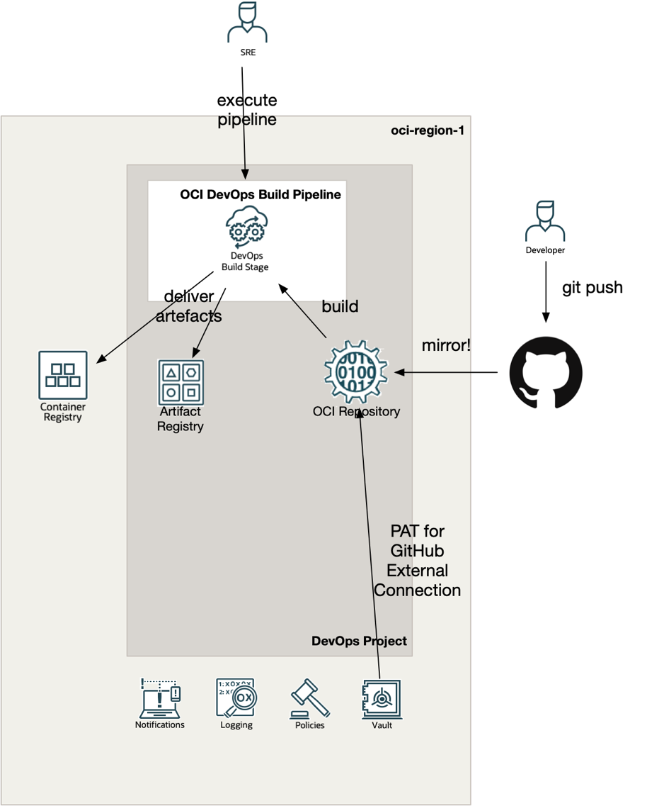

# FoggyKitchen OCI DevOps Service with Terraform 

## LESSON 4 - Adding OCI DevOps Build Pipeline - Deliver Artifact Stage

In the fourth lesson of the OCI DevOps Service course deployed with Terraform, you will further enhance your DevOps project by adding the Deliver Artifact Stage to the OCI DevOps Build Pipeline. This stage will produce two important outcomes for deploying your application.

Firstly, the Deliver Artifact Stage will generate a Docker image containing your application, which has been containerized. This Docker image will be stored in the OCI Registry, providing a centralized and secure location for storing your application images. This image will later be consumed by the OKE Container Engine for Kubernetes for deploying your application as pods.

Secondly, the Deliver Artifact Stage will construct a Helm Artifact. The Helm Artifact consists of a Helm chart that encompasses the entire deployment, including pods, services, and other resources. The original values for the Helm chart will be stored within the OCI DevOps Repository. However, in this lesson, the values will be overwritten by a manifest file stored in a subdirectory specific to this lesson. This allows you to customize and fine-tune the deployment configurations as per your requirements.

By adding the Deliver Artifact Stage to your OCI DevOps Build Pipeline, you enable seamless generation and management of your Docker image and Helm chart. This facilitates efficient and automated deployment of your application on the OKE Container Engine for Kubernetes.



## Deploy Using Oracle Resource Manager

1. Click [](https://cloud.oracle.com/resourcemanager/stacks/create?region=home&zipUrl=https://github.com/mlinxfeld/terraform-oci-devops/releases/latest/download/terraform-oci-devops-lesson4.zip)

    If you aren't already signed in, when prompted, enter the tenancy and user credentials.

2. Review and accept the terms and conditions.

3. Select the region where you want to deploy the stack.

4. Follow the on-screen prompts and instructions to create the stack.

5. After creating the stack, click **Terraform Actions**, and select **Plan**.

6. Wait for the job to be completed, and review the plan.

    To make any changes, return to the Stack Details page, click **Edit Stack**, and make the required changes. Then, run the **Plan** action again.

7. If no further changes are necessary, return to the Stack Details page, click **Terraform Actions**, and select **Apply**. 

## Deploy Using the Terraform CLI

### Clone of the repo
Now, you'll want a local copy of this repo. You can make that with the commands:

Clone the repo from github by executing the command as follows and then go to proper subdirectory:

```
Martin-MacBook-Pro:~ martinlinxfeld$ git clone https://github.com/mlinxfeld/terraform-oci-devops.git

Martin-MacBook-Pro:~ martinlinxfeld$ cd terraform-oci-devops/

Martin-MacBook-Pro:terraform-oci-devops martinlinxfeld$ cd lesson4_devops_build_pipeline_with_deliver_artifact_stage

```

### Prerequisites
Create environment file with TF_VARs:

```
Martin-MacBook-Pro:lesson4_devops_build_pipeline_with_deliver_artifact_stage martinlinxfeld$ vi setup_oci_tf_vars.sh

export TF_VAR_tenancy_ocid="ocid1.tenancy.oc1..aaaaaaaasbkty(...)heqzzxn7pe64ksbia"
export TF_VAR_compartment_ocid="ocid1.compartment.oc1..aaaaaaaaiyy4srmrb32(...)ytywiucgbcp5ext6e4ahjewa"
export TF_VAR_user_ocid="ocid1.user.oc1..aaaaaaaaob4qbf27(...)uunizjie4his4vgh3jx5jxa"
export TF_VAR_fingerprint="85:ee:(...)37:b8:0d:0f:ea"
export TF_VAR_private_key_path="/home/opc/.oci/oci_api_key.pem"
export TF_VAR_region="eu-frankfurt-1"
export TF_VAR_github_pat_vault_secret_id="ocid1.vaultsecret.oc1.eu-frankfurt-1.amaaaaaadngk4gia426(...)ygv5x6ooa"
export TF_VAR_ocir_vault_secret_id="ocid1.vaultsecret.oc1.eu-frankfurt-1.amaaaaaadngk4giavvri7prkglx7gy5ip73q4(...)anih3lqfxhoa"

Martin-MacBook-Pro:lesson4_devops_build_pipeline_with_deliver_artifact_stage martinlinxfeld$ source setup_oci_tf_vars.sh
```

### Create the Resources
Run the following commands:

```
Martin-MacBook-Pro:lesson4_devops_build_pipeline_with_deliver_artifact_stage martinlinxfeld$ terraform init
    
Martin-MacBook-Pro:lesson4_devops_build_pipeline_with_deliver_artifact_stage martinlinxfeld$ terraform plan

Martin-MacBook-Pro:lesson4_devops_build_pipeline_with_deliver_artifact_stage martinlinxfeld$ terraform apply
```

### Destroy the Deployment
When you no longer need the deployment, you can run this command to destroy the resources:

```
Martin-MacBook-Pro:lesson4_devops_build_pipeline_with_deliver_artifact_stage martinlinxfeld$ terraform destroy
```

