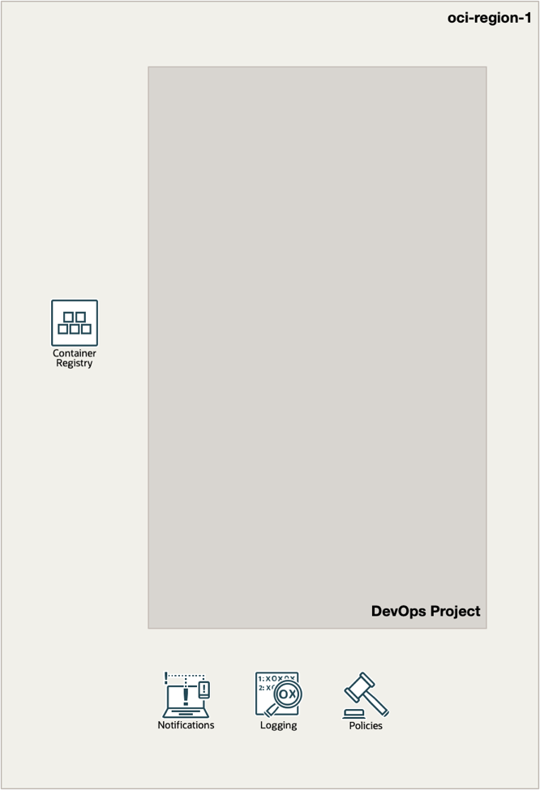

# FoggyKitchen OCI DevOps Service with Terraform 

## LESSON 1 - Creating an Empty DevOps Project with Logging and Notification Services

In this first lesson of the OCI DevOps Service course deployed with Terraform, you will learn how to use Terraform to create the foundational components for your DevOps environment. The lesson focuses on creating an empty DevOps project and integrating essential services such as Logging and Notification.

By following the provided Terraform code, you will be able to provision an empty DevOps project, which serves as a central hub for your software development lifecycle. Additionally, you will configure the Logging service to capture and analyze log data, and set up the Notification service to enable real-time alerts.

To ensure secure access control, this lesson also covers the creation of necessary IAM policies and a Dynamic Group. These policies grant appropriate permissions and the Dynamic Group allows for flexible access management based on dynamic criteria.

Completing this lesson will establish the groundwork for the subsequent lessons in the course, where you will delve deeper into automating deployments, managing version control, and utilizing other advanced features of OCI DevOps Service.

Take the first step towards building your DevOps environment with Terraform and create a solid foundation for streamlined and collaborative software development.



## Deploy Using Oracle Resource Manager

1. Click [](https://cloud.oracle.com/resourcemanager/stacks/create?region=home&zipUrl=https://github.com/mlinxfeld/terraform-oci-devops/releases/latest/download/terraform-oci-devops-lesson1.zip)

    If you aren't already signed in, when prompted, enter the tenancy and user credentials.

2. Review and accept the terms and conditions.

3. Select the region where you want to deploy the stack.

4. Follow the on-screen prompts and instructions to create the stack.

5. After creating the stack, click **Terraform Actions**, and select **Plan**.

6. Wait for the job to be completed, and review the plan.

    To make any changes, return to the Stack Details page, click **Edit Stack**, and make the required changes. Then, run the **Plan** action again.

7. If no further changes are necessary, return to the Stack Details page, click **Terraform Actions**, and select **Apply**. 

## Deploy Using the Terraform CLI

### Clone of the repo
Now, you'll want a local copy of this repo. You can make that with the commands:

Clone the repo from github by executing the command as follows and then go to proper subdirectory:

```
Martin-MacBook-Pro:~ martinlinxfeld$ git clone https://github.com/mlinxfeld/terraform-oci-devops.git

Martin-MacBook-Pro:~ martinlinxfeld$ cd terraform-oci-devops/

Martin-MacBook-Pro:terraform-oci-devops martinlinxfeld$ cd lesson1_empty_devops_project

```

### Prerequisites
Create environment file with TF_VARs:

```
Martin-MacBook-Pro:lesson1_empty_devops_project martinlinxfeld$ vi setup_oci_tf_vars.sh

export TF_VAR_tenancy_ocid="ocid1.tenancy.oc1..aaaaaaaasbkty(...)heqzzxn7pe64ksbia"
export TF_VAR_compartment_ocid="ocid1.compartment.oc1..aaaaaaaaiyy4srmrb32(...)ytywiucgbcp5ext6e4ahjewa"
export TF_VAR_user_ocid="ocid1.user.oc1..aaaaaaaaob4qbf27(...)uunizjie4his4vgh3jx5jxa"
export TF_VAR_fingerprint="85:ee:(...)37:b8:0d:0f:ea"
export TF_VAR_private_key_path="/home/opc/.oci/oci_api_key.pem"
export TF_VAR_region="eu-frankfurt-1"

Martin-MacBook-Pro:lesson1_empty_devops_project martinlinxfeld$ source setup_oci_tf_vars.sh
```

### Create the Resources
Run the following commands:

```
Martin-MacBook-Pro:lesson1_empty_devops_project martinlinxfeld$ terraform init
    
Martin-MacBook-Pro:lesson1_empty_devops_project martinlinxfeld$ terraform plan

Martin-MacBook-Pro:lesson1_empty_devops_project martinlinxfeld$ terraform apply
```

### Destroy the Deployment
When you no longer need the deployment, you can run this command to destroy the resources:

```
Martin-MacBook-Pro:lesson1_empty_devops_project martinlinxfeld$ terraform destroy
```

